# homework-timeseries

This is a homework to learn analysis time series data. [Facebook Prophet](https://facebook.github.io/prophet/docs/quick_start.html#python-api) is tried out. Google Colab is the run platform.

## Files

3 files about MercadoLibre, an ecomm, are provided in the Resources folder. Due to the size limitation at Github, we do not provide the files. They look like these:

* google_hourly_search_trends.csv

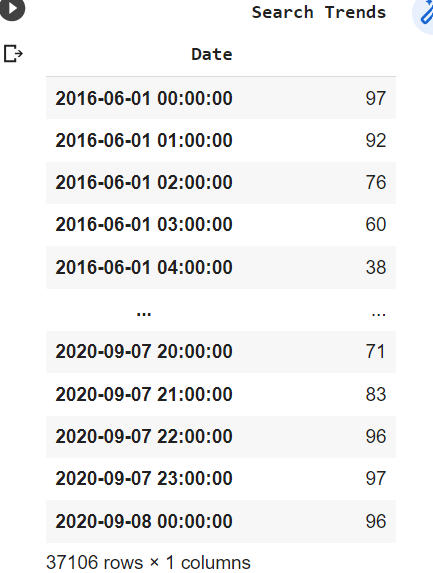

* mercado_stock_price.csv

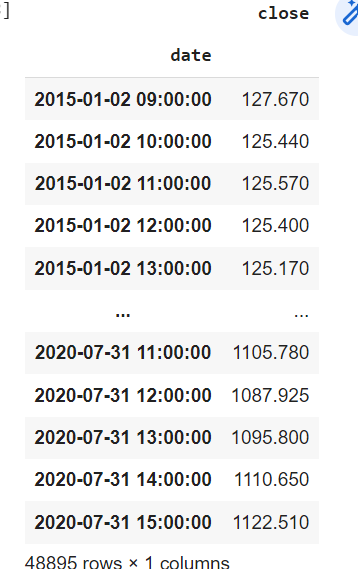

* mercado_daily_revenue.csv

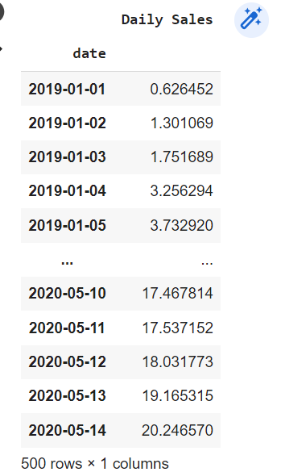

## Analysis

### Manual Analysis Findings

Using various observing, slicing, aggregating and plotting, the following insights stand out:

* We found slight correlation in the search trends and the releasing of quarterly result, in May2020, positively. The result must have been good.

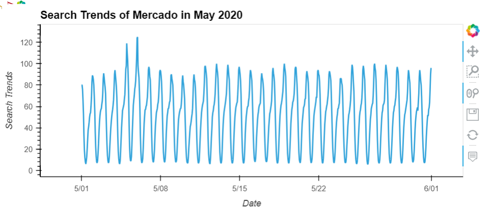

* Trends average during a week is strong Tuesday to Friday. This is a little different from Prophet reporting, which indicates a strong Saturday as well.

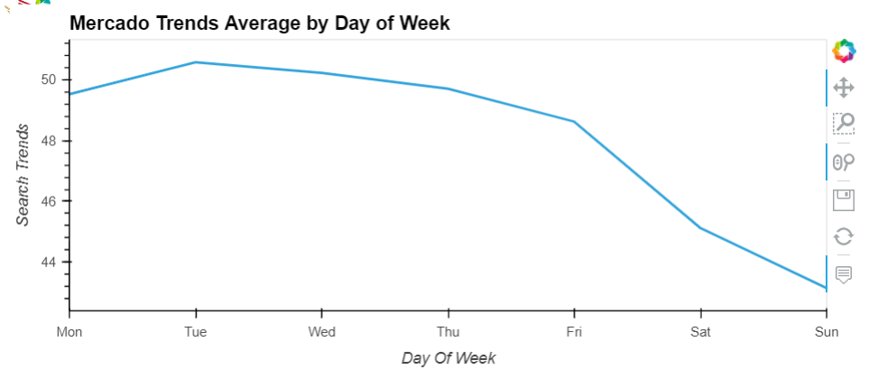

* There is not much correlation between search trends and stock, either in price or in volatility. The trends are stable and the stock price has been going up.

* The major search trends during a day are in the evening and night hours, indicating the MercadoLibre customers have good work ethics.

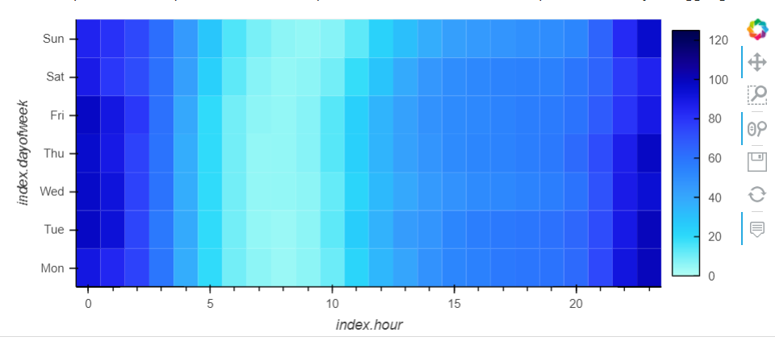

* Holiday season is good for MercadoLibre.

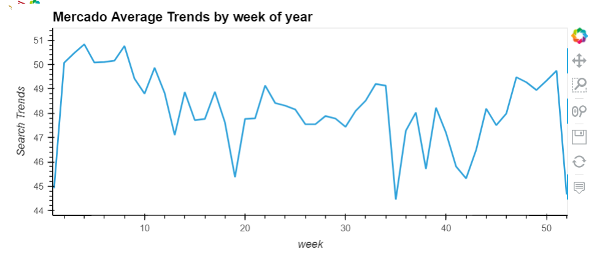

### Prophet Analysis

Leverage Prophet, we gained some insights on the search trends too.

* The overall trends are going down, after the peak in 2019.

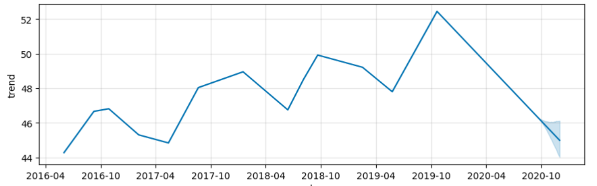

* The yearly, daily, weekly flutuations somehow agree with the manual analysis, with the exception of the Saturday.

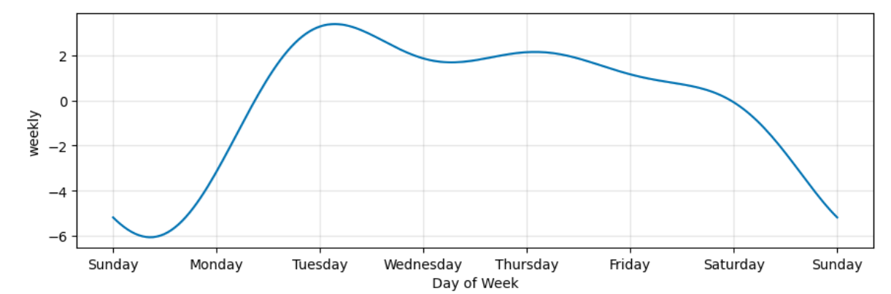

* Prophet predicted the next 2000 hours trends. It does not seem useful. 

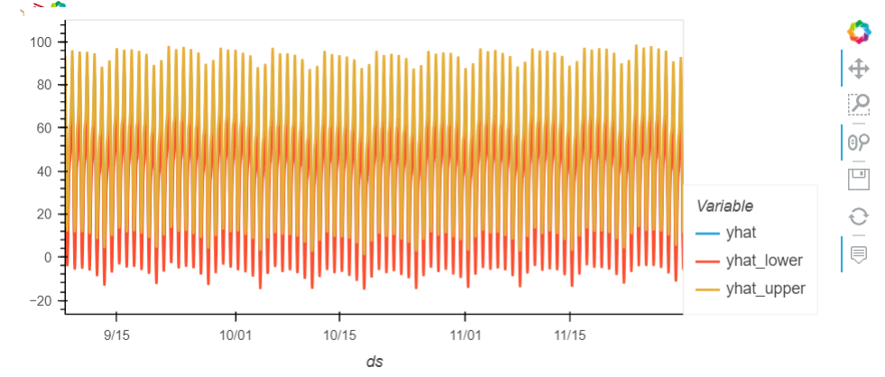

### Sales

Using the revenue data, we also discovered some insights:

* Sales are going up. Same as the stock.

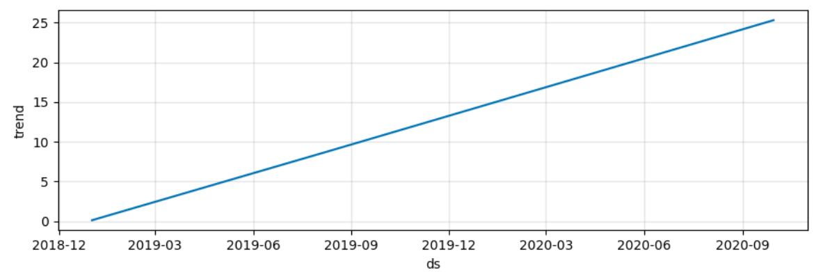

* Sales are strong Monday to Wednesday. Roughly agrees with the search trends.

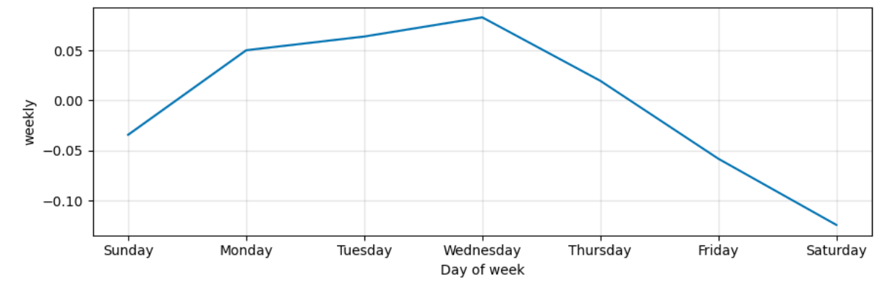

* Using Prophet we have made a forecast for the next quarter to the Sale Team:

    - best      2338.302160
    - worst     1988.685744
    - likely    2163.695778

Going UP!

